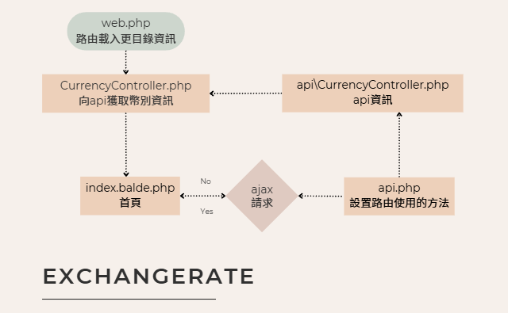

# ExchangeRate 專案

## 流程圖:



## 安裝步驟:

   * 安裝 Composer 依賴
   ```
   composer install
   ```
   * 建立環境設定檔
   ```
   copy .env.example .env
   ```
   * 產生應用程式金鑰
   ```
   php artisan key:generate
   ```
   * 啟動服務
   ```
   php artisan serve
   ```
   * 訪問網站：http://localhost:8000


## 專案設置說明:

後端：Laravel (PHP)
前端：jQuery, Bootstrap

1. **設定路由 (routes/web.php)**
   
   設定路由，將網站首頁的請求導向至 CurrencyController 的 index 方法。

2. **創建網頁控制器 (app/Http/Controllers/CurrencyController.php)**
   
   透過實例化 api\CurrencyController 並調用其 getSupportedCurrenciesArray 方法，獲取幣別陣列，然後將其傳送給視圖 (currency\index.blade.php)。

3. **創建前端視圖 (resources/views/currency/index.blade.php)**
   
   * 設置jQuery將Laravel框架要求的CSRF令牌自動添加到所有AJAX請求的標頭中，以符合Laravel安全保護機制，防止跨站請求偽造攻擊。
   * 阻止表單的預設提交行為，避免頁面重新加載。
   * 設置表單驗證避免空值。
   * 若資料皆正確，隱藏畫面上舊資訊。
   * 獲取輸入資訊。
   * 當AJAX請求成功時，透過指定的URL路徑以POST方法提交表單數據，並將伺服器返回的回應結果即時顯示在頁面上。
   * 若請求失敗，會檢查回應是否包含JSON格式的錯誤訊息。如果回應中有單一錯誤訊（error），則顯示該訊息；如果回應中包含多個錯誤訊息（errors），則將所有錯誤訊息合併後顯示於畫面中。若回應中沒有錯誤訊息，則顯示預設錯誤訊息"發生錯誤，請稍後再試"。

4. **設定 API 路由 (routes/api.php)**
   
   定義API路由，當收到/currency/convert的POST請求時，執行CurrencyController的convert方法來處理請求。

5. **創建 API 控制器 (app/Http/Controllers/api/CurrencyController.php)**
   
   1. **convert 方法**：
      * 將獲取的貨幣代碼轉換為大寫字母，並將金額轉換為浮點數格式。
      * 透過迴圈比對，找到與使用者指定的來源貨幣相符的匯率資料。
      * 確認使用者要兌換的貨幣是否為匯率資料中現有的貨幣，若否則拋出錯誤。
      * 並將使用者欲兌換的金額，乘以目標貨幣的匯率。
      * 將使用者提交的資訊以及計算處理後的轉換結果以JSON格式返回。
   
   2. **getSupportedCurrenciesArray 方法**：
      * 從 $this->currencies中提取所有的base_currency值，並將其組成一個陣列返回。


